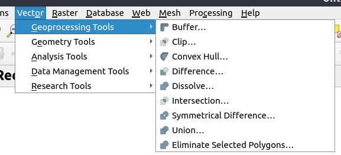

# Taller VECTORES: Aplicación de software de información geográfica y modelado (no terminado)

```{r include=FALSE}
options(warn=-1)

```

**Nota: Existen diferentes recursos para aprender R, sf, stars y raster. Use Google, Baidu o duckduckgo**

- www.github.com/r-spatial/sf
- www.github.com/r-spatial/stars
- www.github.com/rspatial/raster
- https://bookdown.org/
- https://geocompr.robinlovelace.net/
- https://www.datascienceatthecommandline.com/
- https://bookdown.org/rdpeng/rprogdatascience/

**NOTA: SI ALGUNA VEZ TE PIERDES USANDO ALGUNA FUNCION DE R, ESCRIBE `?FUNCION`**
Por ejemplo, si tenemos dudas con la funcion `aggregate`, `plot`, `read.csv`

```{r eval = FALSE}
?aggregate
?plot
?read.csv
```

**NOTA: PARA COMENTAR, ESCRIBA #**

Por ejemplo, 

```{r eval = FALSE}
?aggregate #importante! Esto abre la pagina del manual de la funcion aggregate
```

## Instalacion

Por favor instale las siguientes librerias en R, copie y peque (cole) en R:

```{r eval = FALSE}
install.packages(
  c("sf", "stars", "cptcity", "ggplot2", "raster", "ncdf4", 
    "RNetCDF", "maps", "data.table", "readxl")
)
```


Para correr el ejemplo de stars con Sentinel 5P instale la sigueinte libreria (1 Gb)

```{r eval = FALSE}
install.packages(
  c("starsdata")
)
```


Para realmente comenzar es necesario mencionar que R es un lenguaje de programacion estadistico libre (gratis y abierto) orientado a objeto escrito en C, con bindings directos para C++, C y Fortran.

## R desde Excel, libreoffice, archivos de texto, etc.

A veces debemos o obtenemos datos en hojas de calculo (Libreoffice Calc o Microsoft Office Excel). Cuando este archivo es pequeño no hay problema, pero la realidad es que cada vez es mas frecuente contar con grandes bases de datos y trabajar con un programa de interface grafica se hace dificil. Una de las razones es que la interfaz grafica consume muchos recursos computacionales, que podrian ser usados para el procesamiento de informacion. Por lo tanto

### [El Niño y la Niña](https://www.ncdc.noaa.gov/teleconnections/enso/indicators/sst/)

"El Niño (La Niña) is a phenomenon in the equatorial Pacific Ocean characterized by a five consecutive 3-month running mean of sea surface temperature (SST) anomalies in the Niño 3.4 region that is above (below) the threshold of +0.5°C (-0.5°C). This standard of measure is known as the Oceanic Niño Index (ONI)." [NOAA](https://www.ncdc.noaa.gov/teleconnections/enso/indicators/sst/)


**Vamos a leer la temperatura de la superficie del mar para calcular el indice ONI**

**do (5 min)**
- Abra [https://www.ncdc.noaa.gov/teleconnections/nao/data.csv](https://www.ncdc.noaa.gov/teleconnections/nao/data.csv)
- Como son los datos?
- Cual es la separacion de las columnas?

### Usando base

```{r }
url <- "http://www.cpc.ncep.noaa.gov/products/analysis_monitoring/ensostuff/detrend.nino34.ascii.txt"
# Leyendo datos
oni = read.table(url, h = T)
# construyendo la variable de fecha / data
oni$Date <- as.Date(paste0(oni$YR, ifelse(nchar(oni$MON) < 
                                            2, paste0(0, oni$MON), oni$MON), "01"), format = "%Y%m%d")
# Extrayendo el año
oni$Year <- as.integer(strftime(oni$Date, "%Y"))
# Extrayendo el mes
oni$Month <- as.integer(strftime(oni$Date, "%m"))
# Definiendo la funcion de media movil
ma <- function(x, n = 3) {
  stats::filter(x, rep(1/n, n), sides = 2)
}
# Calculando la media movil
oni$ONI <- ma(oni$ANOM, 3)
# Seleccionando las columnas de interes
oni <- oni[, c("Date", "Year", "Month", "ONI")]
# mostrando las primeras 6 observaciones de cada columna
head(oni)
```


### Usando data.table (mi favorito junto con sf)

data.table es mas rapido que python, julia y spark

**https://h2oai.github.io/db-benchmark/**

```{r eval = FALSE}
library(data.table)
# Leyendo datos
oni = fread(url, h = T)
# construyendo la variable de fecha / data
oni$Date <- as.Date(paste0(oni$YR, ifelse(nchar(oni$MON) < 
                                            2, paste0(0, oni$MON), oni$MON), "01"), format = "%Y%m%d")
# Extrayendo el año
oni$Year <- as.integer(strftime(oni$Date, "%Y"))
# Extrayendo el mes
oni$Month <- as.integer(strftime(oni$Date, "%m"))
# Definiendo la funcion de media movil
ma <- function(x, n = 3) {
  stats::filter(x, rep(1/n, n), sides = 2)
}
# Calculando la media movil
oni$ONI <- ma(oni$ANOM, 3)
# Seleccionando las columnas de interes
oni <- oni[, c("Date", "Year", "Month", "ONI")]
# mostrando las primeras 6 observaciones de cada columna
oni
class(oni)
```


Otras librerias para leer datos tabulares (planihas - spreadsheets):

- [readxl](https://readxl.tidyverse.org/)
- [readr](https://readr.tidyverse.org/)

### summary

```{r}
summary(oni)
```


### Ploteando datos con base

```{r}
?plot
hist(oni$ONI, 
     main = "Hitograma ONI")
boxplot(oni$ONI, 
        main = "Boxplot de ONI")
?boxplot

```

```{r}
library(ggplot2)
library(cptcity)
ggplot(oni, 
       aes(x = Date, y = ONI,colour = ONI)) + 
  geom_line(size = 2)+
scale_colour_gradientn(colours = rev(cpt(find_cpt("cb_div_RdB")[2])), 
                       limit = c(-2.7, 2.7))

```


## Vectores

[GDAL](https://gdal.org/) es la libreria de abstraccion de datos espaciales. Permite leer diferentes tipos de datos de tipo [vectores](https://gdal.org/drivers/vector/index.html) y [raster](https://gdal.org/drivers/raster/index.html. Algunos formatos de vectores:

- [ESRI Shapefile](https://gdal.org/drivers/vector/shapefile.html)
- [Google Earth Engine Data API](https://gdal.org/drivers/vector/eeda.html)
- [GeoJSON](https://gdal.org/drivers/vector/geojson.html) para html
- [GeoPackage](https://gdal.org/drivers/vector/gpkg.html) que es el nuevo formato estandard para la representacion de datos espaciales. Ver [aqui](https://en.wikipedia.org/wiki/GeoPackage). Nuevo estandard ISO (puntos, areas, lineas, volume, etc) [GeoPackage](https://en.wikipedia.org/wiki/GeoPackage), creado por la [Open Geospatial Consortium](https://www.opengeospatial.org/standards/geopackage), es un formato abierto y no propietario de datos espaciales

[sf](https://github.com/r-spatial/sf) significa Spatial Features y es una libreria con interface para las librerias GDAL, GEOS y PROJ que te premite trabajar con datos espaciales de una forma muy parecida que con una hoja de calculo normal.
Como sf esta enlazada con GDAL, permite leer todos los formatos de vector de GDAL direcamente en R.

**Vamos a leer datos de Argentina en formato GeoJSON**

**...**

**Es demasiado OBVIO que podemos leer datos shapefile .shp, por eso para cambiar un poco vamos a leer GeoJSON**

datos bajados de [IGN](http://www.ign.gob.ar/NuestrasActividades/InformacionGeoespacial/CapasSIG)

```{r, fig.width=5, fig.height=8}
library(sf)
df <- read_sf("dados/provincia.json")
head(df)
names(df)
plot(df["geometry"], 
     main = "Provincias de Argentina",
     axes = TRUE)
```


Podemos seleccionar columnas y lineas igual a la forma que lo hicimos anteriormente, y ploteamos estos dados.

```{r}
head(df)
```

Vemos muchos datos, pero vamos a ver los datos unios por departamento. No estoy mostrando aqui pues son 435, pero ya se que vamos a seleccionar "Departamento Belgrano"

```{r }
unique(df$fna)
```

La provincia 17 tiene un nombre muy largo, lo cambiamos asi:

```{r}
df$fna[17] <- "Provincia Antartida"
```

De todas maneras, el campo `fna` tiene muchas veces la pabra "Provincia", camos a eliminarla.

```{r}
df$fna <- gsub(pattern = "Provincia ", replacement = "", x = df$fna)
```


```{r}
library(mapview)
mapview(df, zcol = "fna", legend = T, alpha = 0.8)
```


**Ahora vamos a seleccionar Buenos Aires**

```{r}
plot(df[df$fna == unique(df$fna)[1], "entidad"], 
     axes = T,
     main = unique(df$fna)[1])
```


Ahora, vamos a extraer los centroids de cada poligono

**Recuerda, si tienes dudas de alguna funcion, clica ?FUNCION, por ejemplo, ?st_centroid**

```{r}
cent <- st_centroid(df)
```

El warning se debe a que los datos que tenemos estan en latitud y longitud, y por lo visto, tenemos un dato con limites que no son correctos. Me parece que es la Antartida, debido se ve demasiado grande. Vamos a sacarla y ver como da

```{r}
cent <- st_centroid(df[df$fna != "Antartida", ])

```
Ahora vemos que tenemos un warning diferente. En este caso, st_centroid nos avisa que los geograficos son constantes, pero como sabemos, la tierra es un elipsoide, no una esfera perfecta.

## Geoprocesamiento

El geoprocesamiento incluye diferentes tareas como buffers y otros, como  se ve en [QGIS](https://qgis.org)

```{r out.height="150%"}

```


Iremos a calcular el buffer de cada centroid, sin embargo, primeros vamos a proyectar nuestros datos para UTM con un usado codigo llamado EPSG (European Petroleum Survey Group), como muestra este blog [cafe geodesico](https://cafegeodesico.blogspot.com/2011/12/que-son-los-codigos-epsg.html). Asi cada provincia podria tener un EPSG diferente, para simplificar este curso, utilizaremos el codigo epsg 5346.

Para transformar nuestros datos, tenemos que:

```{r}
dft <- st_transform(cent, 5346)
dft
```


Luego, calculamos el buffer, que puede tener una distancia constante, o una distancia variable:

```{r}
dft_pro <- st_buffer(x = dft, dist = 100000) # 100 km
plot(dft_pro$geometry, axes = T)
```

**Macanudo /Bacan / barbaro / Chevere / Da Ora / Splendid / Cool!**

Podemos calcular perfectamente un buffer con una distancia variable.....


```{r}
dft_pro <- st_buffer(x = dft, 
                     dist = rnorm(n = nrow(dft), mean = 100000, sd = 50000)) # 100 km
plot(dft_pro$geometry, axes = T)
```


Con este grafico hemos ploteado un buffer que tiene un comprimento alteatorio pero con una media de 100 km y un desvio padrao de 50 km, para marcar bien las posibilidades....


Honestamente, puedes hacer muuuchas cosas.

lo que mas me ha asombrado / shocked / chocado /  con sf, es que el processo de gridding de [VEIN](https://rdrr.io/cran/vein/man/emis_grid.html) en qgis demoraba 10 minutos, pero usando sf rn R, demora **10 minutos**
Pero ahora vamos a leer datos meteorologicos y climaticos en grillas (RASTER)
 (next chpater)
