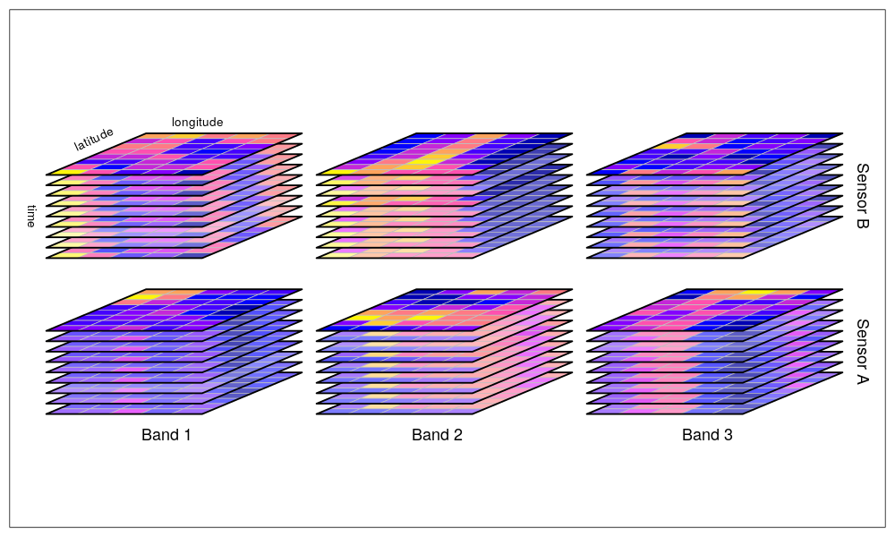

# Taller RASTER Y CUBOS DE DATOS VECTORIALES: Aplicación de software de información geográfica y modelado

gracias Amanda Rehbein <3

[Raster](https://r-spatial.github.io/stars/) son informacion espaciales en una grilla espacial. En general, la informacion de las frillas tiene una distancia homogenea, Por ejemplo, vea las siguientes figuras:




Por ejemplo, cada banda podria representar un tiempo. Como se ve, estos ne realidad son cubos de datos de varias dimensiones, sin embargo, pueden existir grillas irregulares, como las que osn bien represnetadas con el paquete [stars](https://r-spatial.github.io/stars/articles/stars4.html)


Preparense, porque vamos a avanzar directamente en el fondo del mundo de los datos espacio/temporales grillados raster y stars

`raster` es una clase y una libreria de R que representa datos en grillas, llamados raster
`stasr` es una clase y una libreria de R que representa datos en grillas, llamados tambien rasters.
Por lo tanto, `stars` y `raster` tienen conexiones para leer los datos en formato GDAL raster. Que quiere decir esto???? 

Quiere decir que, tal como GDAL lee vectores, tambien lee [raster]((https://gdal.org/drivers/raster/index.html).: Coomopor ejemplo:


- [ASCII](https://gdal.org/drivers/raster/aaigrid.html)
- [ENVI](https://gdal.org/drivers/raster/envi.html)
- [GeoTIFF](https://gdal.org/drivers/raster/gtiff.html)
- [JAXA PALSAR](https://gdal.org/drivers/raster/palsar.html)
- [NetCDF](https://gdal.org/drivers/raster/netcdf.html)
- [GeoSpatial PDF](https://gdal.org/drivers/raster/pdf.html)
- [R](https://gdal.org/drivers/raster/r.html)
- [R Raster](https://gdal.org/drivers/raster/rraster.html)
- [XYZ](https://gdal.org/drivers/raster/xyz.html)


Vamos meterle manos a la obra, vamos a nadar en el mundo multidimensional de los raster y si no saben nadar aprenderan como los pajaros que aprenden ante la subita e inherente necesidada vital de sobrevivir.

[ERA5!](https://www.ecmwf.int/en/forecasts/datasets/reanalysis-datasets/era5)

```{r eval= FALSE}
library(stars)
pcp_era5 <- read_stars("dados/pr_Amon_HadGEM2-ES_historical_r1i1p1_DJF_1985-2004.nc")
names(pcp_era5)
str(pcp_era5)
head(pcp_era5)
```


brick es como literalmente un ladrillo considerndo usualmente la dimension tempral como  un ladrillo.


como vemos, la funcion `str` entrega mucha informacion. Esta funcion no es comunmente usada, pero su archivo de documentacion es ?str

[ERA5](https://www.ecmwf.int/en/forecasts/datasets/reanalysis-datasets/era5), investiguen!


Vamos a plotear estos datos!


```{r}
library(stars)
library(cptcity)
pcp_era5 <- read_stars("dados/pr_Amon_HadGEM2-ES_historical_r1i1p1_DJF_1985-2004.nc")
plot(pcp_era5,
    col = lucky(),
     axes = TRUE)
```


Ahora vamos voy a mostrar todo un script para hacer graficos y analizar datos climaticos usando la libreria `raster`

```{r}
# ------------------------------------#
# Precipitacion y temperatura medias  #
#         Verano y invierno           #
#       (very simple analysis)        #
# ------------------------------------#

library(raster)
library(cptcity)

path <- "dados"

# DJF - VERANO: ####

# Open the precipitation file:
pcp_era5 <- brick("dados/r_ERA5_pcp_DJF_1985-2004.nc")
# Print information and metadata:
pcp_era5 # This file has 17 layers (years)
# Plot the 1st time/year:
plot(pcp_era5[[1]]*3600)      # *3600 to obtain mm/h
# Calculate the mean:
mean_pcp_era <- mean(pcp_era5*3600)

# Opening CMIP5 data model: HadGEM2-ES\
pcp_historical <- brick("dados/pr_Amon_HadGEM2-ES_historical_r1i1p1_DJF_1985-2004.nc")
plot(pcp_historical[[1]]*3600)
mean_pcp_historical <- mean(pcp_historical*3600)
plot(mean_pcp_historical[[1]]*3600,
     main = "HadGEM2-ES mean precipitation [mm/h] \n DJF (1985 - 2004)")

a <- spplot(mean_pcp_era, interpolate = T,
            main = "Observed Precipitation [mm/h] (ERA5) \n DJF (1985 - 2004)",
            at = seq(0, 4, 0.1),
            col.regions = cpt("ncl_precip2_17lev"))
b <- spplot(mean_pcp_historical,
            main = "Simulated precipitation [mm/h] (HadGEM2-ES) \n DJF (1985 - 2004)",
            at = seq(0, 4, 0.1),
            col.regions = cpt("ncl_precip2_17lev"))
gridExtra::grid.arrange(a, b, ncol = 2)
```


Ahora vamos a ver la temperatura

```{r}
# Temperature ####
t2m_era5 <- brick("dados/r_ERA5_t2m_DJF_1985-2004.nc")
t2m_era5
plot(t2m_era5[[1]] - 273.15)      # -273.15 to obtain ºC
mean_t2m_era <- mean(t2m_era5 -273.15)

t2m_historical <- brick("dados/tas_Amon_HadGEM2-ES_historical_r1i1p1_DJF_1985-2004.nc")
plot(t2m_historical[[1]] - 273.15)
mean_t2m_historical <- mean(t2m_historical - 273.15)

c <- spplot(mean_t2m_era,
            main = "Observed temperature at 2m [ºC] (ERA5) \n DJF (1985 - 2004)",
            at = seq(-40, 40, 1),
            col.regions = cpt("ncl_temp_diff_18lev"))
d <- spplot(mean_t2m_historical,
            main = "Simulated temperature at 2m [ºC] (HadGEM2-ES) \n DJF (1985 - 2004)",
            at = seq(-40, 40, 1),
            col.regions = cpt("ncl_temp_diff_18lev"))
gridExtra::grid.arrange(c, d, ncol = 2)


# Calculate the bias (how model is different from the observation):
pcp_bias <- (mean_pcp_historical - mean_pcp_era)
t2m_bias <- (mean_t2m_historical - mean_t2m_era)


f <- spplot(pcp_bias,
            main = "Precipitation bias [mm/h] \n DJF (1985 - 2004)",
            at = seq(-3, 3, 0.1),
            col.regions = cpt("ncl_precip_diff_12lev"))
g <- spplot(t2m_bias,
            main = "Temperature bias [ºC] \n DJF (1985 - 2004)",
            at = seq(-15, 15, 1),
            col.regions = cpt("ncl_temp_diff_18lev"))
gridExtra::grid.arrange(f, g, ncol = 2)


gridExtra::grid.arrange(a, b, f,
                        c, d, g,  ncol = 3)


# JJA - invierno: ####
# Try it by your self.


```

