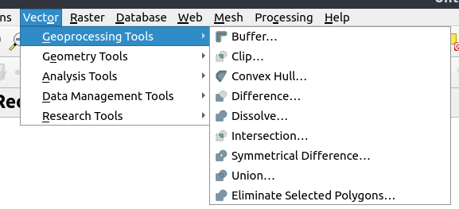

--- 
title: "Seminário Latinoamericano: Instrumentos y metodologias para un observatório de Clima y su impacto en la salud humana "
author: "Sergio Ibarra-Espinosa, Universidade de São Paulo, sergio.ibarra@usp.br, ibarraespinosa.github.io"
date: "`r Sys.Date()`"
site: bookdown::bookdown_site
output: bookdown::gitbook
documentclass: book
bibliography: [book.bib, packages.bib]
biblio-style: apalike
link-citations: yes
github-repo: ibarraespinosa/UBA
description: "Emisiones/Calidad del Aire /sf/stars/raster."
header-includes:
   - \usepackage{url}
   - \usepackage{graphicx}
---

# Curso de R, contaminacion atmosferica y mas {-}

Este curso online contendra las sisgueinetes informaciones

- Sistemas de informacion con dartos de salud en Chile (gracias Paty Matus)
- Impacto de las emisiones antropogenicas en la salud y clima
- R desde Excel
- Leer y procesar vectores espaciales con **sf** [@sf]
- Leer y procesar informacion en grillas espaciales (raster) con stars[@stars] y raster[@raster]

## Aprender Git  {-}

Para aprender GIT puedes ver:

- https://git-scm.com/book/es/v1/Empezando
- https://learngitbranching.js.org/
- https://try.github.io/

## Clonar este contenido  {-}

Para clonar este contenido haz:

```{bash eval=FALSE}
git clone https://github.com/ibarraespinosa/UBA.git
```


```{r include=FALSE}
# automatically create a bib database for R packages
knitr::write_bib(c(
  .packages(), 'vein', 'eixport'
), 'packages.bib')
```

<!--chapter:end:index.Rmd-->

# Sistemas de informacion con datos de salud en Chile {#intro}


- Sistema de información en salud existentes
- Enfasis en las fuentes de información y las escala temporal/espacial que manejan
- Series de tiempo disponible por fuente
- Instituciones a cargo de la captura, procesamiento y análisis
- Disponibilidad de los datos e indicadores que producen
- Otros

## [Encuesta Nacional de Salud (ENS)](http://www.encuestas.uc.cl/ens/index.html)

La ENS es una encuesta realizada por el Ministerio de Salud para identificar cuales son las 
enfermedades que sufren y los tratamientos que reciben todas las personas con mas de 15 años 
que viven en Chile. De esta forma es posible es posible realizar diagnosticos,
identificar problemas y formular politicas planes y proyectos para mejor la salud de las personas.

- *Organismo	responsable*:	Ministerio	de	Salud,	Departamento	de	Epidemiología	
Gobierno	de	Chile.	
- *Organismo	ejecutor*: Pontificia	Universidad	Católica	de	Chile	(PUC).	
- *Población	objetivo*: Personas	de	15	años	y	más,	chilenas	o	extranjeras	que	residen	habitualmente	en	viviendas	particulares	ocupadas,	localizadas	en	zonas	urbanas	y	rurales	de	las	quince	regiones	de	Chile.	
- *Representatividad*: Nacional,	regional	y	Urbano/Rural.	
- *Modo	de	aplicación*: Entrevista	personal	en	hogar	(Sistema	de	captura	electrónica:	Tablet),	aplicada	por	encuestador	y	profesional	enfermera	de	acuerdo	al	tipo	de	cuestionario.	
- *Período	de	trabajo	de	campo*: Agosto	2016	a	marzo	2017	
- *Tamaño	muestral*: 6.233	encuestados,	de	los	cuales	5.520	cuentan	con	exámenes	de	laboratorio	de	acuerdo	a	protocolo. 37,1% hombres, 62,9% mujeres.	
- *Error	muestral*: Error	absoluto	de	muestreo	de	2,6%	a	nivel	nacional,	raíz	del	efecto	de	diseño	de	1,797, estimaciones	con	95%	de	confianza	y	error	relativo	inferior	a	30%.	

Algunos resultados:

- Consumo de tabaco: 66,7% no fuma, 33,$ fuma.
- Consumo riesgoso de alcohol 11,7%, 20,5% hombres, 3,3% mujeres.
- Sedentarismo: 86,7%, 83,3% hombre, 90.0% mujeres.
- Estado nutricional: 1,3% enfraquecido, 24,5% normal, 39,8% sobrepeso, 31,2% obeso, 3,2% obeso morbido.
- Sospecha de hipertension: 27,6%.
- Sospecha de diabetes: 12,3%.
- Autoreporte de infarto agudo al miocardio: 3,3%.
- Autoreporte de ataque cerebro vascular: 2,6%.


Fuentes:

- https://www.minsal.cl/wp-content/uploads/2017/11/ENS-2016-17_PRIMEROS-RESULTADOS.pdf
- https://www.minsal.cl/wp-content/uploads/2018/01/2-Resultados-ENS_MINSAL_31_01_2018.pdf
- http://www.encuestas.uc.cl/ens/index.html

## [Departamento de Estadisticas e Informaciones de Salud](http://www.deis.cl/)

- Resúmenes estadísticos mensuales ([REM](http://www.deis.cl/bases-de-datos-rem/)). Vea el [manual](http://estadisticas.ssosorno.cl/estadisticas/2017/manuales/2017-2018-Manual-Series-REM-V1.1.pdf)
- [Defunciones](http://www.deis.cl/bases-de-datos-defunciones/)
- [Egresos](http://www.deis.cl/descargar-bases-de-datos-2/?page_id=3487)
- [Nacimientos](http://www.deis.cl/descargar-bases-de-datos-2/?page_id=3493)
- [Atenciones de urgencia](http://www.deis.cl/descargar-bases-de-datos-2/?page_id=3499)
- [Enfermedades de notificacion obligatoria](http://www.deis.cl/descargar-bases-de-datos-2/?page_id=3784)
- [Enfermedades transmitidas por alimentos](http://www.deis.cl/estadisticas-eta/)
- [Tuberculosis](http://www.deis.cl/?page_id=3946)

## Epidemiologia

- [Vigilancia Epidemiologica](http://epi.minsal.cl/)

## [Encuesta de caracterizacion socioeconomica (CASEN)](http://observatorio.ministeriodesarrollosocial.gob.cl/casen-multidimensional/casen/casen_2017.php)
"La Encuesta de Caracterización Socioeconómica Nacional (Casen) del Ministerio de Desarrollo Social es una encuesta a hogares, de carácter multipropósito, es decir, que abarca diversos temas como educación, trabajo, ingresos, salud, entre otros; además es una encuesta transversal, por lo tanto, incluye a todo el espectro de la población del país."

## Estadisticas generales

- [Instituto Nacional de Estadisticas](www.ine.cl)

## CEPAL STAT

- [Estadisticos e indicadores](http://estadisticas.cepal.org/cepalstat/WEB_CEPALSTAT/estadisticasIndicadores.asp)
- [Perfiles Nacionales](http://estadisticas.cepal.org/cepalstat/WEB_CEPALSTAT/estadisticasIndicadores.asp)
- [Publicaciones y estadisticas](http://estadisticas.cepal.org/cepalstat/WEB_CEPALSTAT/PublicacionesEstadisticas.asp)

## Banco Interamericano de Desarrollo

- [Educacion](http://www.iadb.org/en/research-and-data//tables,6882.html?indicator=2)
- [Mercado Laboral](http://www.iadb.org/en/research-and-data//tables,6882.html?indicator=2)
- [Ingreso](http://www.iadb.org/es/investigacion-y-datos//tablas,6882.html?indicator=4)
- [Pobreza](http://www.iadb.org/es/investigacion-y-datos//pobreza,7526.html)
- [Demografia](http://www.iadb.org/es/investigacion-y-datos//tablas,6882.html?indicator=1)


## Datos de contaminacion atmosferica y meteorologia

- [SINCA](https://sinca.mma.gob.cl/)
- [QUALAR](https://qualar.cetesb.sp.gov.br/qualar/home.do)
- [RESEARCH DATA ARCHIVE](https://rda.ucar.edu/)
- [CMIP](https://esgf-node.llnl.gov/projects/cmip6/)
- [AchemMip](https://wiki.met.no/aerocom/aerchemmip/start)
- [IPCC DATA](https://www.ipcc.ch/data/)
- [RCP](http://www.iiasa.ac.at/web-apps/tnt/RcpDb/dsd?Action=htmlpage&page=welcome)
- [TELECONNECTIONS](https://www.ncdc.noaa.gov/teleconnections/)

## Algunos exemplos de datos de series de tiempo

Efecto de la contamiancion atmosferica sobre los accidentes cerebros vasculares 

```{r echo = FALSE, fig.cap="Accidentes Cerebro Vasculares Chile (Leiva et al., 2013)"}
knitr::include_graphics(path = "figs/strokes.png")
```


<!--chapter:end:01-intro.Rmd-->

# Impacto de las emisiones antropogénicas en la calidad del aire y clima

La contaminacion es una amenaza a la salud global que causo 9 millones de muertes en 2015, 16% de las muertes [@landrigan2018lancet]. Ademas, existe consenso cientifico de la existencia y relacion con la actividad humana sobre el cambio climatico [@cook2016consensus]. Tanto la contaminacion atmosferica como los gases de efecto invernadero, conocidos tambien como forzantes climaticos de vida corta y larga son causados por compuestos quimicos liberados en la atmosfera, las llamadas emisiones. Por lo tanto, es importante realziar y entender la caracterizacion espacial y temporal de las emisiones, asi como sus efectos en la salud y en el clima.

Algunos efectos de la contaminacion atmosferica en la salud

- incrementa la morbilidad, natalidad
- aumenta la tasa de nacimientos con problemas (menos peso, inteligencia)
- incrementa riesgo de cancer
- etc et etc

La atmosfera es una delgada capa sobre la tierra, 50% de su masa esta 5.6 km esta compuestos por varios gases [@brasseur2017modeling], cuya composicion es:


| Gas     | Razon molar $mol \cdot mol^{-1}$| Principal fuente y comentarios [@brasseur1999atmospheric]|
|:--------:|:------------------------------:|:-----------------:|
|Nitrogeno ($N_2$) | 0.78 | Biologica |
|Oxigeno ($O_2$) | 0.21 |  Biologica |
|Argon ($A_r$)   | 0.0093 | Inerte |
|Dioxido de carbono ($CO_2$)   | $400 \cdot10^{-6}$ | Combustion, oceano, biosfera|
|Neon ($N_e$)   | $18 \cdot10^{-6}$ | Inerte|
|Ozono ($O_3$)   | $0.01-10 \cdot10^{-6}$ | Fotoquimico|
|Helio ($H_e$)   | $5.2 \cdot10^{-6}$ | Inerte|
|Metano ($CH_4$)   | $1.8 \cdot10^{-6}$ | Biogenico y antropogenico|
|Hidrogeno ($H_2$)   | $500 \cdot10^{-9}$ | Biogenico, antropogenico y fotoquimico| 
|Oxido nitroso ($N_2O$)   | $330 \cdot10^{-9}$ | Biogenico y antropogenico|


## Contaminacion atmosferica - Introduccion

**"La contaminación del aire es un determinante importante de la salud. La OMS estima que en 2012 alrededor de 1 de cada 8 muertes se atribuyeron a la exposición a la contaminación del aire, lo que lo convierte en el mayor factor de riesgo ambiental para la mala salud."**[@oms]


La ciencia de la contaminacion atmosferica, si bien reciente, ha sido desarrollada debido a los avances de en la comprension de la meteorologia. Problemas relacionados con la contaminacion atmosferica han sido descritos en obras literarias y cartas a lo largo de la historia. Por ejemplo, se cree que el primer caso reportado sobre los efectos de la contaminacion atmosférica en la salud es sobre Gaius Plinius Secundus, Geografo, (AD 23-AD 79), quien habria fallecido los efectos de la **emisiones** del volcan Vesuvius [@art;@vis]. La erupcion del volcan Vesuvius duro 19 horas, con altura de lacolumna entre 14 y 32 km y deposicion de material piroplastico de hasta 2500 $kg \cdot m^{-2}$ [@macedonio1988numerical].


```{r echo = FALSE, fig.cap="An eruption of Vesuvius seen from Portici, by Joseph Wright (ca. 1774-6), Dominio Publico"}
knitr::include_graphics(path = "figs/1280px-Joseph_Wright_of_Derby_-_Vesuvius_from_Portici.jpg")
```


Sin embargo han sido los grandes episodios de contaminacion los que han gatillado su estudio y gestion por parte de los tomadores de decisiones. Entre ellos se pueden mencionar el desastre de Londres 1952 y la acidifacion de los lagos escandinavos.

### El desastre de Londres 1952

Altas concentraciones de contaminantes fueron ocurrieron entre el 5 y 9 de Diciembre de 1952 en Londres, Inglaterra. Para comparacion, vea el monumento "Columna de Nelson" en condiciones normales[@nelson1], y el dia de la llamada "Gran Niebla de Londres"[@nelson2]

```{r echo = FALSE, fig.cap="Columna de Nelson, Dominio Publico", out.height= "90%", out.width="90%"}
knitr::include_graphics(path = "figs/800px-Nelson's_Column,_Trafalgar_Square,_London.jpeg")
```


```{r echo = FALSE, fig.cap="Columna de Nelson durante la Gran Niebla de 1952, Dominio Publico"}
knitr::include_graphics(path = "figs/Nelson's_Column_during_the_Great_Smog_of_1952.jpg")
```


#### Consecuencias

A pesar que durante la fecha, las autoridades no consideraron el efecto de la contaminacion, este evento si causoo gran impacto en la comunidad [@l1952]. Estudios posteriores cuantificaron un impacto en **12.000 muertos** asociados a este episodio de contaminacion [@bell2001reassessment]. 


```{r echo = FALSE, fig.cap="Mortalidad semanal y concentraciones de SO2 en Lobres 1952 (Bell and Davis, 2001)", out.width="120%"}
knitr::include_graphics(path = "figs/so2lon.png")
```


```{r echo = FALSE, fig.cap="Mortalidad semanal y concentraciones de SO2 en Lobres 1952 (Bell and Davis, 2001)", out.width="120%"}
knitr::include_graphics(path = "figs/so2lon2.png")
```

*comentarios?*

#### CLRTAP

```{r echo = FALSE}
message("Tarea / Tema de casa / Homework:")

print("Investique que es, causas, consequencias y poltiica ambiental asociada a CLRTAP")
```

## Contaminantes atmosfericos

Las emisiones liberadas a la atmosfera impactan la salud, meteorologia y clima en diferentes escalas como se ve en la sigueinte figura. 

```{r echo = FALSE, fig.cap="Esquema de impacto de emisiones (Ibarra, 2017)", out.width="130%"}
knitr::include_graphics(path = "figs/esquema.png")
```

Por lo tanto para entender las emisiones necesitamos respnder las siguientes preguntas:

- **Que?**
- **Como?**
- **Cuando?**
- **Donde?**

Los contaminantes atmosfericos suelen ser clasificados como:

- Primarios: emitidos directamente en la atmosfera. Ejemplo: CO.
- Secundarios: formados en la atmosfera. Ejemplo: $O_3$.

Existen muchos contaminantes atmosfericos de interes cientifico como 

- Ozono $O_3$
- Monoxido de Carbono $CO$
- Radicales de Oxidos de nitrogeno $NO_X \equiv NO + NO_2$
- Compuestos organicos volatiles $COV$
- Radicales de Halogeno
- Especies de azufre $SO_2$, $SO4$, $H_2SO_4$
- Aersoles

**Cada contaminante tiene un extenso cuerpo teorico. En esta parte del curso nos referiremos brevemente al $O_3$, aerosoles y especies de azufre, sin embargo, el estudiante puede revisar la bibliografia para se aprofundar.**

### Ozono $O_3$

Respecto del ozono es necesario mencionar que existen dos tipos, el estratosferico (bueno) y y el troposferico (malo),
como es expicado por @brasseur2017modeling.

El ciclo deo ozono troposferico comienza con la fotolisis de lamolecula de ox[igeno devido a radiacion solar de longitud de onda minimo 242 nm. Posteriormente, un atomo de oxigeno se combina con otra molecula de oxigeno para formar ozono. La molecula M (cuerpo inerte, como $N_2$ o $O_2$)  estabiliza la molecula de $O_3$ recien formada.

\begin{equation}
O_2 + hv(\lambda < 242 nm) 	\rightarrow O + O 
(\#eq:1)
\end{equation}

\begin{equation}
O + O_2 + M 	\rightarrow O_3 + M 
(\#eq:2)
\end{equation}


El Ozono luego es fotolizado a un atomo de oxigeno y una molecula de oxigeno ante radiacion menor a 1180 nm, liberando energia cinetica [@o3]. 

En el caso del ozono troposfeico, la reaccion comienza quando el [radical hidroxilo](https://en.wikipedia.org/wiki/Hydroxyl_radical) $\cdot OH$ oxida el $CO$ generando el radical $\cdot HOCO$ que es inestable y reacciona rapidamente con $O_2$ generando el [peroxi radical](https://en.wikipedia.org/wiki/Hydroperoxyl) $\cdot HO_2$ y $CO_2$. El peroxi radical reacciona oxida $NO$ generando $NO_2$ y un radical hidroxilo. Luego el $NO_2$ es fotolizado liberando un atomo de oxigeno que reacciona con la molecula de $O_2$ generando $O_3$.


\begin{equation}
O_3 + hv(\lambda < 1180 nm) 	\rightarrow O + O_2 + energia cinetica 
(\#eq:3)
\end{equation}

En el caso del ozono troposferico, los ingredientes principales son radiacion solar, $NO_x$ y compuestos organicos volatiles [@o3wiki]. 

\begin{equation}
\cdot OH + CO 	\rightarrow \cdot HOCO
(\#eq:4)
\end{equation}


\begin{equation}
\cdot HOCO + O_2 	\rightarrow HO_2\cdot + CO_2
(\#eq:5)
\end{equation}

\begin{equation}
HO_2\cdot + NO 	\rightarrow \cdot OH + NO_2
(\#eq:6)
\end{equation}

\begin{equation}
NO_2 + hv(\lambda < 400nm) 	\rightarrow NO + O
(\#eq:7)
\end{equation}


\begin{equation}
O + O_2 	\rightarrow O_3
(\#eq:8)
\end{equation}

Los mecanismos mostrados son un resumen de complejas reacciones en la atmosfera donde muchas otras reacciones y compuestos juegan un rol. 

### Especies de azufre

El es un compuesto que reacciona generando importantes contaminantes como sulfatos y acido sulfurico, importantesen la lluvia aida (deposicion acida). Los combustibles tienen azufre y durante la combustion, el azufre es oxidado generando $SO_2$, diesel tiene mayor cantidad de azufre que gasolina, por lo tanto generando mas $SO_2$. Tambien existe el dimetilsulfido (DMS) $(CH3)_2S$, que es biogenico, asi como el carbonilo sulfido (COS), que largo tiempo de vida que permite su transporte a la estratosfera. A continuacion una resumen de los mecanismos de generacion de acido sulfurico [@brasseur2017modeling]. $SO_2$ es oxiado por $OH$


\begin{equation}
SO_2 + OH + M 	\rightarrow HSO_3 + M
(\#eq:9)
\end{equation}

\begin{equation}
HSO_3 + O_2 	\rightarrow  SO_3 + HO_2
(\#eq:10)
\end{equation}

\begin{equation}
SO_3 + H2O + M \rightarrow  H_2SO_4 + M
(\#eq:11)
\end{equation}

### Aerosoles

Son particulas suspendidas desde ~0.001 $\mu m$ hasta 100 $\mu m$ (luster molecular a gota). Conocido como material particulado (MP), sus caracerizacion es realizada mayormente en base a su diametro aerodinamico como se muestra en la sigueinte figura [@mpwiki][@brasseur2017modeling]. Existen tres agrupaciones que son:

1. Modo Aiken: nucleos de condensacion nuevos (fresh) que condensan (gas) o coagulan (liquidos). Diametro hasta 100 nm.
2. Modo acumulacion: Diametro entre 100 y 1000 nm.
3. Modo coarse: Diametro mayor que 1000 nm.

```{r echo = FALSE, fig.cap="Distribucion normalizada (suma es 1000) de aerosoles por diametro aerodinamico, Dominio Publico", out.width = "120%"}
knitr::include_graphics(path = "figs/800px-Synthetic_aerosol_distribution_in_number_area_and_volume_space.png")
```

Los aersolos son claisficados por numeros, area de superficie y volumen. Normalmente las agencias de medio ambiente miden $MP_{10}$ (diametro menos <= que 10 $\mu m$) y $MP_{2.5}$ (diametro menos <= que 2.5 $\mu m$) en $\mu g \cdot m^{-3}$. A continuacion una figura mostrando material particulado en Chile, Brazil y China.

**Chile ***

```{r echo = FALSE, fig.cap="MP2.5 ug/m3 em Lautaro, Chile (https://sinca.mma.gob.cl/index.php/estacion/index/key/870)"}
knitr::include_graphics(path = "figs/chile1.png")
```


**China**

```{r echo = FALSE, fig.cap="MP2.5 ug/m3 em Hotan, China (http://pm25.in/hetiandiqu)", out.width="150%"}
knitr::include_graphics(path = "figs/hotan.png")
```

ingrese aqui: https://aqicn.org/forecast/beijing/

**Osasco, Brasil**


```{r echo = FALSE, fig.cap="MP2.5 ug/m3 Osasco, Brasil (https://qualar.cetesb.sp.gov.br)", out.width="150%"}
knitr::include_graphics(path = "figs/brazil.png")
```


[NASA WORLDVIEW](https://worldview.earthdata.nasa.gov/) es un excelente recurso para monitorear aerosoles, incendios y mucho mas.

```{r echo = FALSE}
message("Ingrese a https://worldview.earthdata.nasa.gov/ y busque aerosol")
```


## Forzantes climaticos y gases de efecto invernadero

El efecto invernadero es un fenomeno que e produce naturalmente en la tierra, sin intervencion humana. Por ejemplo, concentraciones biogenicas de CO2 o el vapor de agua. Sin embargo, el termino forzante climatico se refiere de estos compuestos quimicos tienen una incidencia en el clima, pues alteran el cambio en iradiancia neta $W \cdot m^{-2}$.


El forzante radiativo es utilizado como predictor de cambio en la media global de temperatura. IPCC [@schimel1996radiative] define forzamiento radiativo como:

“The radiative forcing of the surface-troposphere system due to the perturbation in or the introduction of an agent
(say, a change in greenhouse gas concentrations) is the change in net (down minus up) irradiance (solar plus long-wave; in Wm−2) at the tropopause AFTER allowing for stratospheric temperatures to readjust to radiative equilibrium, but with surface and tropospheric temperatures and state held fixed at the unperturbed values” [@schimel1996radiative]


Del sitio web de Copernicus (https://atmosphere.copernicus.eu/climate-forcing:

"Climate forcing measures the imbalance in the Earth’s energy budget caused by a perturbation of the climate system, for example changes in atmospheric composition driven by human activities. **Climate forcing, also known as Radiative Forcing, therefore determines the change in globally-averaged temperature change due to the natural or human-induced changes to the energy budget**. Increases in greenhouse gas concentrations over the industrial era are responsible for a positive climate forcing, causing a gain of energy in the climate system. In contrast, changes in atmospheric aerosol concentrations result in a negative climate forcing leading to a loss of energy. It is the balance between these various climate forcings that drive the change in global temperature." https://atmosphere.copernicus.eu/climate-forcing


```{r echo = FALSE, fig.cap="Cambio en la temperatura media debido a forzantes radiativas (https://atmosphere.copernicus.eu/climate-forcing)", out.width="120%"}
knitr::include_graphics(path = "figs/SPM1_figure-final-947x1024.png")
```


```{r echo = FALSE, fig.cap="Cambio en la temperatura media debido a forzantes radiativas (https://atmosphere.copernicus.eu/climate-forcing)"}
knitr::include_graphics(path = "figs/SPM.03-01.png")
```

Esta figura muestra un resumen de los compuestos y su forzante radiativo (FR) [@stocker2014climate]

```{r echo = FALSE, fig.cap="Forzante radiativo (https://atmosphere.copernicus.eu/climate-forcing)"}
knitr::include_graphics(path = "figs/ipcc.jpg")
```


### Efectos directos e indirectos de aerosoles

- Directo: Influencia en balance radiativo.
- Indirecto: Influencia en el climia.
- Primer efecto indirecto: microfisica de la precipitacion. 
- Segundo efecto indirecto: Cantidad  de lluvia.


```{r echo = FALSE, fig.cap="Forzantes indirectos (Robwood, 2019) (https://atmos.uw.edu/~robwood/teaching/591/ATMS_591_Albrecht_1989.pdf)", out.width="110%"}
knitr::include_graphics(path = "figs/fx.png")
```

### Black Carbon - Carbono negro

Son particulas producto de la combustion incompleta de combustibles con origen antropogenico y biogenico.
Considerado el segundo gas de efecto invernadero despues de CO2 [@bond2013bounding]. 


```{r echo = FALSE, fig.cap="UNEP (https://twitter.com/UNEnvironment/status/1150404638501416961/photo/1", out.width="90%"}
knitr::include_graphics(path = "figs/bc.png")
```


## Emisiones y sus fuentes

Un inventario de emisiones es la compilacion del flujo de masa de contaminantes emitida en un lugar y tiempo determinado.

Son definidos por la ecuacion basica de :


\begin{equation}
E = FE \cdot NA
(\#eq:12)
\end{equation}

Donde E es la emision, FE es el factor de emision y NA el nivel de actividad. Por ejemplo, si queremos saber las emisiones de vehiculos, FE esta en **g/km**, NA es la cantidad de vehiculos veces la distancia que recorren **km** en un tiempo determinado, luego E es la masa **g** de contaminantes.

### Tipos

Ya que ya sabemos los contaminantes y su forzamiento radiativo, podemos ver cuales son las fuentes de ellos, desde elpunto de vista de contaminacion atmosferica y clima. Existen varios tipos de fuentes de emisiones:


```{r echo = FALSE, fig.cap="Fuentes de emisiones", out.width="130%"}
knitr::include_graphics(path = "figs/fuentes.png")
```

Pueden tener aplicaciones de gestion y cientificas:

```{r echo = FALSE, fig.cap="Tipos de inventarios (Pules and Helsinga, 2013)", out.width="150%"}
knitr::include_graphics(path = "figs/theart2.png")
```

Por ejemplo, IPCC entrega guias para que los paises compilen inventarios de emisiones de gases de fecto invernadero:


```{r echo = FALSE, fig.cap="Actualizacion en las guias de inventarios de emisiones IPCC (https://www.ipcc-nggip.iges.or.jp/public/2019rf/index.html)"}
knitr::include_graphics(path = "figs/ipcc2.jpg")
```


Ahora podemos ver como ha sido la serie de emisiones globales de gases de efecto invernadero:


```{r echo = FALSE, fig.cap="Serie de emisiones)", out.width="120%"}
knitr::include_graphics(path = "figs/ipcc3.png")
```


```{r echo = FALSE, fig.cap="CO2 y temperatura (http://www.ipcc.ch/report/graphics/))", out.width="150%"}
knitr::include_graphics(path = "figs/ipcc4.png")
```

### Calidad y criterio

Un inventario de emisiones debe considerar la aseguracion de la calidad. En este sentido, los cientificos buscan errores, puntos debiles. Los tomadores de decisiones (UNFCC-IPCC) buscan consenso.
Por lo tanto, la calidad para los inventarios cientificos consiste en que las estimaciones tienen que ser confirmadas, calibradas y validadas. Y en el plano politico, un inventario de calidad genera in acuerdo y protocolo que todos deben atacar (VEA CLRTAP)

### Dimensiones

Como **cientificos** necesitamos responder las siguentes preguntas:

- Que: Que contaminante (especifico) es emitido.
- Como: Cual es el proceso.
- Cuando: Caracterizacion temporal.
- Onde: Caracterizacion temporal.

** Mapas interactivos de Inventario de emisiones vehiculares de Sao Paulo (Ibarra 2017)**

- [PM2.5](http://jornal.usp.br/wp-content/uploads/gPM.html)
- [NOx](http://jornal.usp.br/wp-content/uploads/gNOx.html)
- [CO](http://jornal.usp.br/wp-content/uploads/gCO.html)
- [HC](http://jornal.usp.br/wp-content/uploads/gHC.html)

### Categorias llave

En los inventarios de emisiones muchas veces pocas categorias emiten la mayor cantidad de contaminantes. Estas son las **categorias llave** y es en ellas donde debemos invertir la mayor cantidad de esfuerzo y recurso economico.

### Bottom-up y top-down

En las guias de emisiones europeas, -@NtziachristosSamaras2016 muestra la definicion de los enfoques bottom-up y top-down.

```{r echo = FALSE, fig.cap="Bottom up y top-down", out.width="120%"}
knitr::include_graphics(path = "figs/bt.png")
```

### Ejemplo de factores de emision (real-time GPS)


```{r echo = FALSE, fig.cap="(Ibarra-Espinosa et al., 2019 under-review)"}
knitr::include_graphics(path = "figs/fig4_LDV_CO.png")
```


## Nuevos modelos de emisiones: VEIN

En el ultimo par de años se han publicado nuevos modelos para el calculo de emisiones, como el Vehicular Emissions Inventory model [@gmd] que consiste en una libreria en R (https://atmoschem.github.io/vein/).


```{r echo = FALSE, fig.cap="(Ibarra-Espinosa et al., 2018, https://atmoschem.github.io/vein/)", out.width="130%"}
knitr::include_graphics(path = "figs/vein1.png")
```


```{r echo = FALSE, fig.cap="(Ibarra-Espinosa et al., 2018, https://atmoschem.github.io/vein/)", out.width="130%"}
knitr::include_graphics(path = "figs/vein2.png")
```


## Nuevos datos, satelites y modelacion inversa

La modelacion inversa esta siendo utilizada para corregir y re estimar emisiones con los nuevos datos de satelite disponibles [@acp-18-5483-2018]:

```{r echo = FALSE, fig.cap="(Kaiser et al., 2018)", out.width="130%"}
knitr::include_graphics(path = "figs/acp.png")
```

Columna total de NO2 en europa con Sentinel 5P libreria stars [@stars]

```{r echo = FALSE, fig.cap="STARS! Sentinel 5P", out.width="150%"}
knitr::include_graphics(path = "figs/sentinel.png")
```


<!--chapter:end:02-literature.Rmd-->

# Taller VECTORES: Aplicación de software de información geográfica y modelado (no terminado)

```{r include=FALSE}
options(warn=-1)

```

**Nota: Existen diferentes recursos para aprender R, sf, stars y raster. Use Google, Baidu o duckduckgo**

- www.github.com/r-spatial/sf
- www.github.com/r-spatial/stars
- www.github.com/rspatial/raster
- https://bookdown.org/
- https://geocompr.robinlovelace.net/
- https://www.datascienceatthecommandline.com/
- https://bookdown.org/rdpeng/rprogdatascience/

**NOTA: SI ALGUNA VEZ TE PIERDES USANDO ALGUNA FUNCION DE R, ESCRIBE `?FUNCION`**
Por ejemplo, si tenemos dudas con la funcion `aggregate`, `plot`, `read.csv`

```{r eval = FALSE}
?aggregate
?plot
?read.csv
```

**NOTA: PARA COMENTAR, ESCRIBA #**

Por ejemplo, 

```{r eval = FALSE}
?aggregate #importante! Esto abre la pagina del manual de la funcion aggregate
```

## Instalacion

Por favor instale las siguientes librerias en R, copie y peque (cole) en R:

```{r eval = FALSE}
install.packages(
  c("sf", "stars", "cptcity", "ggplot2", "raster", "ncdf4", 
    "RNetCDF", "maps", "data.table", "readxl")
)
```


Para correr el ejemplo de stars con Sentinel 5P instale la sigueinte libreria (1 Gb)

```{r eval = FALSE}
install.packages(
  c("starsdata")
)
```


Para realmente comenzar es necesario mencionar que R es un lenguaje de programacion estadistico libre (gratis y abierto) orientado a objeto escrito en C, con bindings directos para C++, C y Fortran.

## R desde Excel, libreoffice, archivos de texto, etc.

A veces debemos o obtenemos datos en hojas de calculo (Libreoffice Calc o Microsoft Office Excel). Cuando este archivo es pequeño no hay problema, pero la realidad es que cada vez es mas frecuente contar con grandes bases de datos y trabajar con un programa de interface grafica se hace dificil. Una de las razones es que la interfaz grafica consume muchos recursos computacionales, que podrian ser usados para el procesamiento de informacion. Por lo tanto

### [El Niño y la Niña](https://www.ncdc.noaa.gov/teleconnections/enso/indicators/sst/)

"El Niño (La Niña) is a phenomenon in the equatorial Pacific Ocean characterized by a five consecutive 3-month running mean of sea surface temperature (SST) anomalies in the Niño 3.4 region that is above (below) the threshold of +0.5°C (-0.5°C). This standard of measure is known as the Oceanic Niño Index (ONI)." [NOAA](https://www.ncdc.noaa.gov/teleconnections/enso/indicators/sst/)


**Vamos a leer la temperatura de la superficie del mar para calcular el indice ONI**

**do (5 min)**
- Abra [https://www.ncdc.noaa.gov/teleconnections/nao/data.csv](https://www.ncdc.noaa.gov/teleconnections/nao/data.csv)
- Como son los datos?
- Cual es la separacion de las columnas?

### Usando base

```{r }
url <- "http://www.cpc.ncep.noaa.gov/products/analysis_monitoring/ensostuff/detrend.nino34.ascii.txt"
# Leyendo datos
oni = read.table(url, h = T)
# construyendo la variable de fecha / data
oni$Date <- as.Date(paste0(oni$YR, ifelse(nchar(oni$MON) < 
                                            2, paste0(0, oni$MON), oni$MON), "01"), format = "%Y%m%d")
# Extrayendo el año
oni$Year <- as.integer(strftime(oni$Date, "%Y"))
# Extrayendo el mes
oni$Month <- as.integer(strftime(oni$Date, "%m"))
# Definiendo la funcion de media movil
ma <- function(x, n = 3) {
  stats::filter(x, rep(1/n, n), sides = 2)
}
# Calculando la media movil
oni$ONI <- ma(oni$ANOM, 3)
# Seleccionando las columnas de interes
oni <- oni[, c("Date", "Year", "Month", "ONI")]
# mostrando las primeras 6 observaciones de cada columna
head(oni)
```


### Usando data.table (mi favorito junto con sf)

data.table es mas rapido que python, julia y spark

**https://h2oai.github.io/db-benchmark/**

```{r eval = FALSE}
library(data.table)
# Leyendo datos
oni = fread(url, h = T)
# construyendo la variable de fecha / data
oni$Date <- as.Date(paste0(oni$YR, ifelse(nchar(oni$MON) < 
                                            2, paste0(0, oni$MON), oni$MON), "01"), format = "%Y%m%d")
# Extrayendo el año
oni$Year <- as.integer(strftime(oni$Date, "%Y"))
# Extrayendo el mes
oni$Month <- as.integer(strftime(oni$Date, "%m"))
# Definiendo la funcion de media movil
ma <- function(x, n = 3) {
  stats::filter(x, rep(1/n, n), sides = 2)
}
# Calculando la media movil
oni$ONI <- ma(oni$ANOM, 3)
# Seleccionando las columnas de interes
oni <- oni[, c("Date", "Year", "Month", "ONI")]
# mostrando las primeras 6 observaciones de cada columna
oni
class(oni)
```


Otras librerias para leer datos tabulares (planihas - spreadsheets):

- [readxl](https://readxl.tidyverse.org/)
- [readr](https://readr.tidyverse.org/)

### summary

```{r}
summary(oni)
```


### Ploteando datos con base

```{r}
?plot
hist(oni$ONI, 
     main = "Hitograma ONI")
boxplot(oni$ONI, 
        main = "Boxplot de ONI")
?boxplot

```

```{r}
library(ggplot2)
library(cptcity)
ggplot(oni, 
       aes(x = Date, y = ONI,colour = ONI)) + 
  geom_line(size = 2)+
scale_colour_gradientn(colours = rev(cpt(find_cpt("cb_div_RdB")[2])), 
                       limit = c(-2.7, 2.7))

```


## Vectores

[GDAL](https://gdal.org/) es la libreria de abstraccion de datos espaciales. Permite leer diferentes tipos de datos de tipo [vectores](https://gdal.org/drivers/vector/index.html) y [raster](https://gdal.org/drivers/raster/index.html. Algunos formatos de vectores:

- [ESRI Shapefile](https://gdal.org/drivers/vector/shapefile.html)
- [Google Earth Engine Data API](https://gdal.org/drivers/vector/eeda.html)
- [GeoJSON](https://gdal.org/drivers/vector/geojson.html) para html
- [GeoPackage](https://gdal.org/drivers/vector/gpkg.html) que es el nuevo formato estandard para la representacion de datos espaciales. Ver [aqui](https://en.wikipedia.org/wiki/GeoPackage). Nuevo estandard ISO (puntos, areas, lineas, volume, etc) [GeoPackage](https://en.wikipedia.org/wiki/GeoPackage), creado por la [Open Geospatial Consortium](https://www.opengeospatial.org/standards/geopackage), es un formato abierto y no propietario de datos espaciales

[sf](https://github.com/r-spatial/sf) significa Spatial Features y es una libreria con interface para las librerias GDAL, GEOS y PROJ que te premite trabajar con datos espaciales de una forma muy parecida que con una hoja de calculo normal.
Como sf esta enlazada con GDAL, permite leer todos los formatos de vector de GDAL direcamente en R.

**Vamos a leer datos de Argentina en formato GeoJSON**

**...**

**Es demasiado OBVIO que podemos leer datos shapefile .shp, por eso para cambiar un poco vamos a leer GeoJSON**

datos bajados de [IGN](http://www.ign.gob.ar/NuestrasActividades/InformacionGeoespacial/CapasSIG)

```{r, fig.width=5, fig.height=8}
library(sf)
df <- read_sf("dados/provincia.json")
head(df)
names(df)
plot(df["geometry"], 
     main = "Provincias de Argentina",
     axes = TRUE)
```


Podemos seleccionar columnas y lineas igual a la forma que lo hicimos anteriormente, y ploteamos estos dados.

```{r}
head(df)
```

Vemos muchos datos, pero vamos a ver los datos unios por departamento. No estoy mostrando aqui pues son 435, pero ya se que vamos a seleccionar "Departamento Belgrano"

```{r }
unique(df$fna)
```

La provincia 17 tiene un nombre muy largo, lo cambiamos asi:

```{r}
df$fna[17] <- "Provincia Antartida"
```

De todas maneras, el campo `fna` tiene muchas veces la pabra "Provincia", camos a eliminarla.

```{r}
df$fna <- gsub(pattern = "Provincia ", replacement = "", x = df$fna)
```


```{r}
library(mapview)
mapview(df, zcol = "fna", legend = T, alpha = 0.8)
```


**Ahora vamos a seleccionar Buenos Aires**

```{r}
plot(df[df$fna == unique(df$fna)[1], "entidad"], 
     axes = T,
     main = unique(df$fna)[1])
```


Ahora, vamos a extraer los centroids de cada poligono

**Recuerda, si tienes dudas de alguna funcion, clica ?FUNCION, por ejemplo, ?st_centroid**

```{r}
cent <- st_centroid(df)
```

El warning se debe a que los datos que tenemos estan en latitud y longitud, y por lo visto, tenemos un dato con limites que no son correctos. Me parece que es la Antartida, debido se ve demasiado grande. Vamos a sacarla y ver como da

```{r}
cent <- st_centroid(df[df$fna != "Antartida", ])

```
Ahora vemos que tenemos un warning diferente. En este caso, st_centroid nos avisa que los geograficos son constantes, pero como sabemos, la tierra es un elipsoide, no una esfera perfecta.

## Geoprocesamiento

El geoprocesamiento incluye diferentes tareas como buffers y otros, como  se ve en [QGIS](https://qgis.org)

```{r out.height="150%"}

```


Iremos a calcular el buffer de cada centroid, sin embargo, primeros vamos a proyectar nuestros datos para UTM con un usado codigo llamado EPSG (European Petroleum Survey Group), como muestra este blog [cafe geodesico](https://cafegeodesico.blogspot.com/2011/12/que-son-los-codigos-epsg.html). Asi cada provincia podria tener un EPSG diferente, para simplificar este curso, utilizaremos el codigo epsg 5346.

Para transformar nuestros datos, tenemos que:

```{r}
dft <- st_transform(cent, 5346)
dft
```


Luego, calculamos el buffer, que puede tener una distancia constante, o una distancia variable:

```{r}
dft_pro <- st_buffer(x = dft, dist = 100000) # 100 km
plot(dft_pro$geometry, axes = T)
```

**Macanudo /Bacan / barbaro / Chevere / Da Ora / Splendid / Cool!**

Podemos calcular perfectamente un buffer con una distancia variable.....


```{r}
dft_pro <- st_buffer(x = dft, 
                     dist = rnorm(n = nrow(dft), mean = 100000, sd = 50000)) # 100 km
plot(dft_pro$geometry, axes = T)
```


Con este grafico hemos ploteado un buffer que tiene un comprimento alteatorio pero con una media de 100 km y un desvio padrao de 50 km, para marcar bien las posibilidades....


Honestamente, puedes hacer muuuchas cosas.

lo que mas me ha asombrado / shocked / chocado /  con sf, es que el processo de gridding de [VEIN](https://rdrr.io/cran/vein/man/emis_grid.html) en qgis demoraba 10 minutos, pero usando sf rn R, demora **10 minutos**
Pero ahora vamos a leer datos meteorologicos y climaticos en grillas (RASTER)
 (next chpater)

<!--chapter:end:03-method.Rmd-->

# Taller RASTER Y CUBOS DE DATOS VECTORIALES: Aplicación de software de información geográfica y modelado  (no terminado)

Amanda Rehbein


Raster son informacion espaciales en una grilla espacial. Por ejemplo, vea las siguientes figuras:


Ejemplos con R


```{r eval= FALSE}

```


<!--chapter:end:04-application.Rmd-->

# Estudios de series de tiempo para asociar salud y variables ambientales


Uno de los metodos mas validados y establecidos para identificar asociaciones entre mortalidad, morbilidad, y otros parametros con variables ambientales son las series de tiempo. 

Algunos de los autores clasicos sobre este tipo de estudios estan:

- Francesca Dominici [link google scholar]
- Luis Cifuentes [link google scholar]
- Petros Koutrakis [link google scholar]
- Paulo Saldiva [link google scholar]
- Michelle Bell [link google scholar]
- Antonela Zanometti [link google scholar]

Francesca Dominici ha publicado diferentes estudios y actualizado la metodologia de estudios de series de tiempo considerando la distribucion estadistica, control de los factores de confusion y modelos generales aditivos.

## Distribucion

Los estudios de series de tiempo consideran en general variables diarias. En este sentido, las variables de salud son conteos diarios con una distribucion apropiada, generalmente Poisson o Binomail Negativa, por ejemplo. Estas son diferentes de la distribucion normal. 

Densidad de la distribucion de Poisson:

\begin{equation}
p(x) = \lambda^x exp(-\lambda)/x!
(\#eq:12)
\end{equation}

Densidad de la distribucion de Normal:

\begin{equation}
f(x) = 1/( (2 \pi) \sigma) e^-((x - \mu)^2/(2 \sigma^2)^0.5 )
(\#eq:13)
\end{equation}


Vamos a ver un ejemplo:

```{r echo = FALSE, out.height="150%"}
Poisson <- rpois(1000, lambda = 4)
Normal <- rnorm(1000, 10)
par(mfrow = c(1,2))
hist(Poisson, main = "Distribucion de Poisson")
hist(Normal, main = "Distribucion Normal")
par(mfrow = c(1,1))
```


## Efecto de la contaminacion

Dominici presento el modelo semi-parametrico usando modelos generales aditivos [@gam] para el estudio de series de tiempo. Este modelo consiste en:

\begin{equation}
log(m) = \beta_0 + \beta_1 \cdot X_i + s(meteo) + s(time) + s(season) + ...
(\#eq:13)
\end{equation}

Donde m es la variable dependiente sobre salud, $\beta$ son los coeficientes, $X_i$ son los contaminantes, $s$ es una funcion spline  

Luego, la asociacion resultante es el riesgo relativo [@rosana]:

\begin{equation}
RR = exp(\beta_i \cdot \delta X_i)
(\#eq:13)
\end{equation}


Que indica el riesgo relativo dada un cambio en la variable, por ejemplo, si se incrementan las concentraciones de PM10 en 50 ug/m3, el riesgo de mortalidad respiratoria aumenta 7%. Aplicando este porcentaje sobre la poblacion es posible calcular la mortalidad anual asociada a la contaminacion. Vamos a ver valores reales para Argentina y Chile [@rosana].


```{r echo = FALSE, out.height="180%", fig.cap="Riesgo relativo en mortalidad por incremento de 1 ppm de CO (Abrutzky et al., 2013)"}
knitr::include_graphics(path = "figs/rosana1.png")
```

## Efecto de la temperatura

Puede se utilizada la misma metodologia pero considerando variables meteorologicas en este caso. Un trabajo muy interesante recientemente publicado por el grupo de Paulo Saliva es el efecto de la temperatura en diferentes ciudades del mundo [@GASPARRINI2015369].


```{r echo = FALSE, out.height="180%", fig.cap="Riesgo relativo en mortalidad por incremento de 1 ppm de CO (Abrutzky et al., 2013)"}
knitr::include_graphics(path = "figs/temp1.png")
```


<!--chapter:end:05-summary.Rmd-->

`r if (knitr:::is_html_output()) '
# References {-}
'`

<!--chapter:end:06-references.Rmd-->

